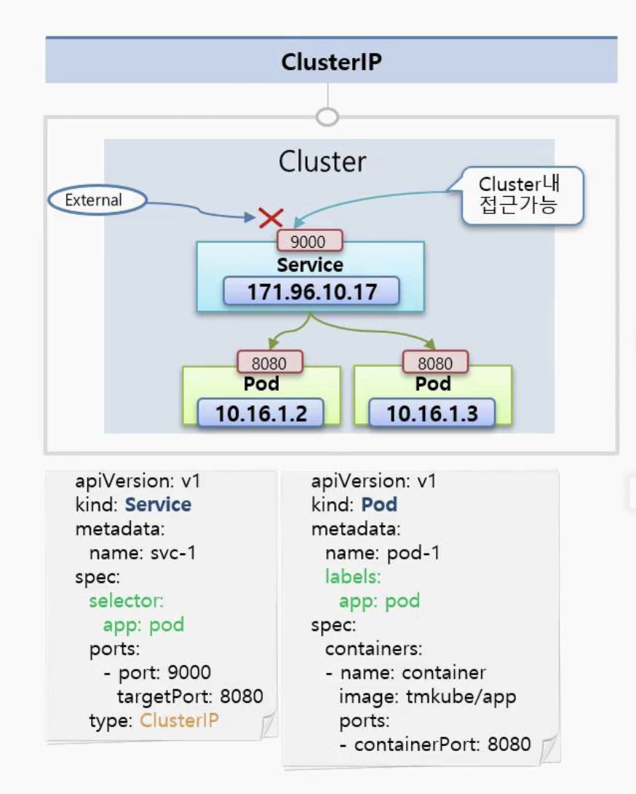
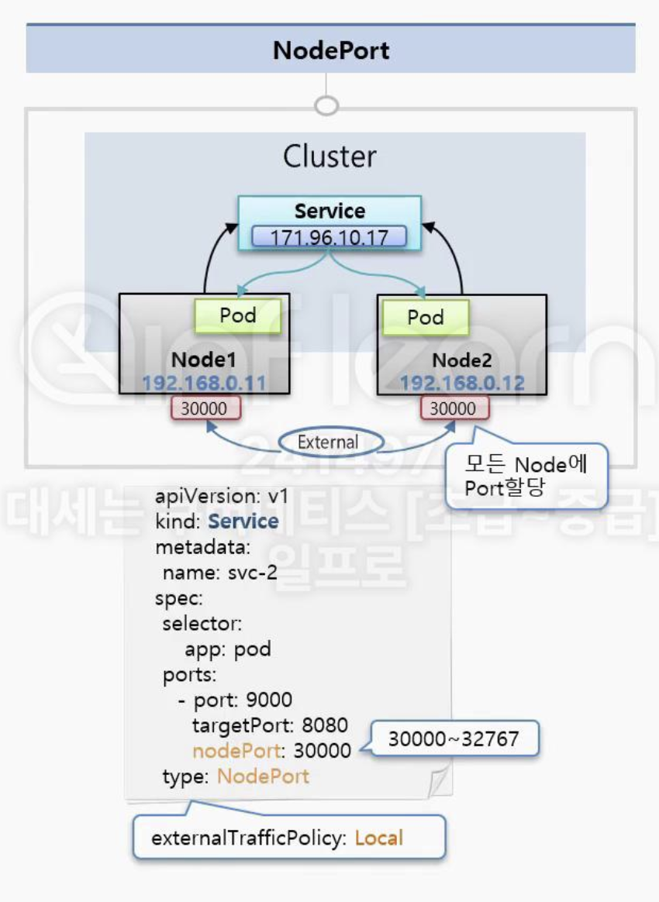
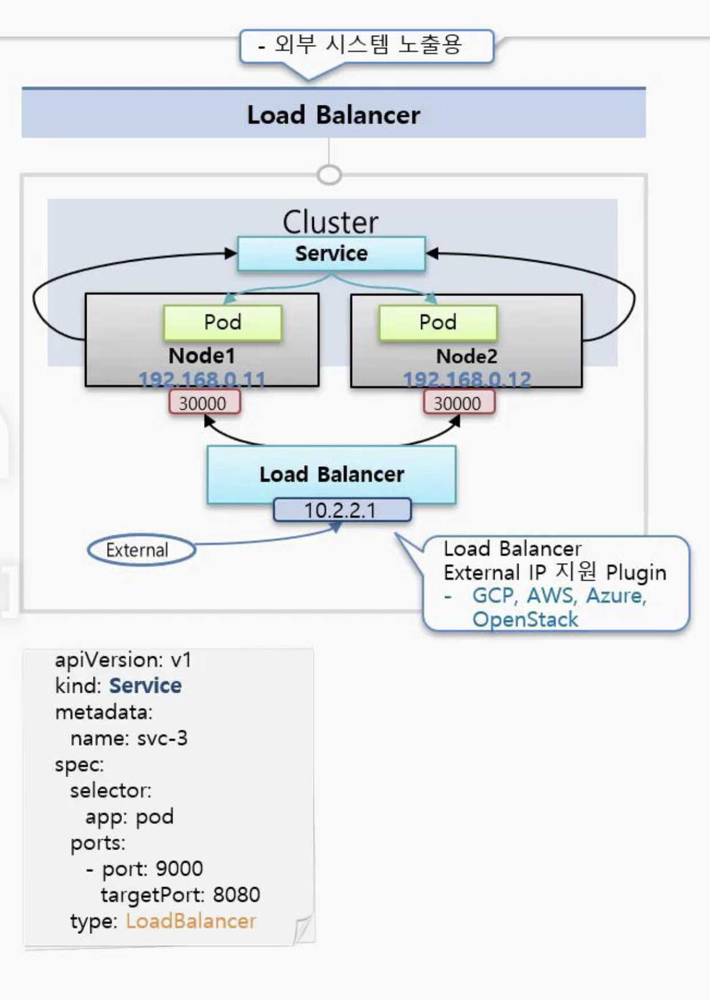

# Service - ClusterIP, NodePort, LoadBalancer

k8s의 `Service 종류`로는 `ClusterIP`, `NodePort`, `LoadBalancer`가 존재한다.  
`ClusterIP`의 경우 `k8s 내부 통신`만 `지원`하며, `NodePort`는 `외부 IP+Port`로 `통신`하고,  
`LoadBalancer`의 경우 벤더사(AWS, GCP, Azure)의 `LB`를 사용하여 `외부 통신`을 수행한다.

또한 `Service`는 `k8s`의 `기본 오브젝트`로써 `수신한 트래픽`을 `여러 파드`로 `로드밸런싱`(부하 분산) 하는 `기능`을 `제공`한다.  
`ClusterIP`는 `클래스터 내부`에서만 사용 가능한 `가상 엔드포인트 IP`를 제공하는 LB(L4)를 구성한다.  
NodePort는 외부 클라이언트가 서비스를 통해서 클러스터 내부의 파드로 접속할 때 사용 가능하다(L7)

## k8s Service - ClusterIP?



> ClusterIP가 default type

- `Service`는 기본적으로 `자기 자신`만의 `ClusterIP`를 가지고 있다
- `Service`를 `Pod`에 `연결`해두면, `Service의 IP`를 통해 `Pod에 접근`이 `가능`해진다
  - 1개의 Service에 여러개의 Pod 연결 가능
- Pod도 IP가 존재하는데, 왜 Service를 달아서 접근 해야하지?
  - Pod는 시스템 장애로 인해 언제든 죽을 수 있음
  - `Pod`가 죽으면 재생성되고, IP는 다시 할당되기에 `신뢰성`이 `떨어진다`
- 이에 반해서 Service는 사용자가 지우지 않는 이상 삭제/중지되지 않음
  - 이를 통해 연결에 대한 신뢰성 보장 가능

```yaml
# Service 생성
---
apiVersion: v1 # k8s api version
kind: Service # kind of object resource
metadata:
  name: svc-1 # metadata
spec:
  selector:
    app: pod # label
  ports:
    - port: 9000 # Service의 노출 포트
      targetPort: 8080 # pod의 내부 포트
  type: ClusterIP # default가 ClusterIP
```

- `Service`의 `type 옵션`은 `default`가 `ClusterIP`이다
- port: Service의 외부 노출 포트 의미
- targetPort: Pod의 내부 포트 의미

```yaml
# Pod 생성
---
apiVersion: v1
kind: Pod
metadata:
  name: pod-1
  labels:
    app: pod
spec:
  containers:
  - name: pod-1
    image: tmkube/app
    ports:
    - containerPort: 8080
```

## k8s Service - NodePort?



- NodePort Type으로 만들어도 기본적으로 ClusterIP가 할당이 되고, ClusterIP와 같은 기능이 포함되어 있음
- NodePort Type의 특징으로는 k8s에 연결된 모든 노드(Node)에 똑같은 포트가 할당
  - 외부로부터 IP+Port로 접속을 하면, 해당 Node에 연결된 Service에 연결이 된다
  - Service는 자신한테 연결된 Pod로 트래픽을 전달
  - `Pod가 있는 Node에만 Port가 할당되는 것이 아니라, 모든 Node에 Port가 할당됨`

```yaml
---
apiversion: v1
kind: Service
metadata:
  name: svc-2
spec:
  selector:
    app: pod
  ports:
    - port: 9000
      targetPort: 8080
      nodePort: 30000 # 30000 - 32767 사이만 지정 가능
  type: NodePort
```

- 각 노드에 Pod가 1개씩 올라가 있는 경우, 1번 노드의 IP로 접근하여도 Node 2번으로 트래픽을 전달할수도 있다
- externalTrafficPolicy: Local
  - 특정 IP로 접근하는 트래픽은 서비스가 특정 노드의 Pod로 트래픽을 전달

## k8s Service - Load Balancer



- `Load Balancer Type`은 `NodePort`의 `성격`을 그대로 `상속`한다
- 추가적으로 `Load Balancer`라는게 생겨서 `각 노드에 트래픽을 분산`하는 `역할`을 `담당`한다
- 문제점은 이 Load Balancer에 접근하기 위한 외부 접속 external IP는 기본적으로 생기지 않음
  - 별도로 외부 접속 external IP를 할당하는 플러그인이 설치되야 함
  - GCP, AWS, Azure는 external IP 지원 Plugin 이미 있음

```yaml
---
apiversion: v1
kind: Service
metadata:
  name: svc-3
spec:
  selector:
    app: pod
  ports:
    - port: 9000
      targetPort: 8080
  type: LoadBalancer
```

> k8s service는 이외에도 여러가지 용도로 사용된다  
> 이제 각 service가 어떤 상황에서 사용되는지 알아보자

- ClusterIP
  - 내용 정리
    - `ClusterIP`는 `외부 접근`이 `불가능`하며, `가상 IP`를 가진 `엔드포인트`를 제공하는 LB를 구성한다
  - 접근 대상
    - 이 `IP`에 `접근`하는 `대상`은 클러스터 내부에 접근 가능한 `인가 가능한 사람만 접근 가능`
  - 접근 목적
    - k8s 대시보드 접근, Pod 상태 관리 등등
- NodePort
  - 내용 정리
    - NodePort는 IP + Port를 통해 외부 접근이 가능하며, 특정 IP 요청 시 Service를 거쳐 다시 Node의 Pod로 트래픽 전달
    특별한 정책이 있지않는 한 트래픽 전달은 랜덤
  - 접근 대상
    - 보안적으로 내부망에서만 접근 가능하도록 네트워크를 구성하기에, 클러스터 밖에는 있지만 내부망 안에서 접근해야하는 경우 사용
  - 접근 목적
    - 일시적인 외부 연동용으로 사용
- Load Balancer
  - 내용 정리
    - 실질적으로 외부에 서비스를 노출하려면 LB를 사용해야함, 그래야 내부 IP 노출 없이 외부 노출 가능

## 99. 참고 자료

- [[kubernetes]서비스 타입 비교(ClusterIP/NodePort/LoadBalancer)](https://kim-dragon.tistory.com/52)
- [[Kubernetes] Service (ClusterIP & NodePort) 이해하기](https://kim-dragon.tistory.com/52)