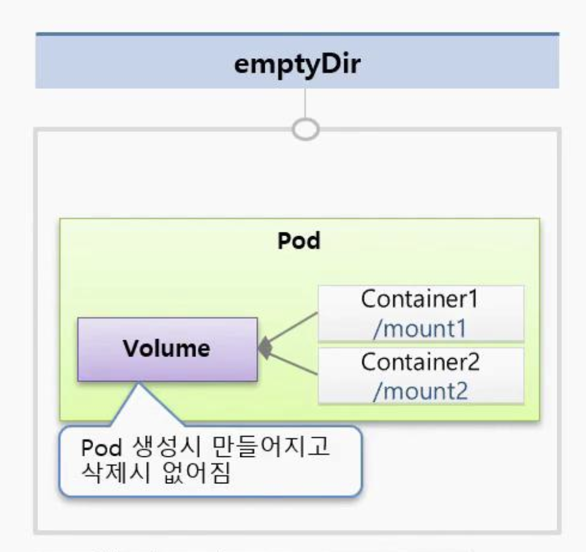
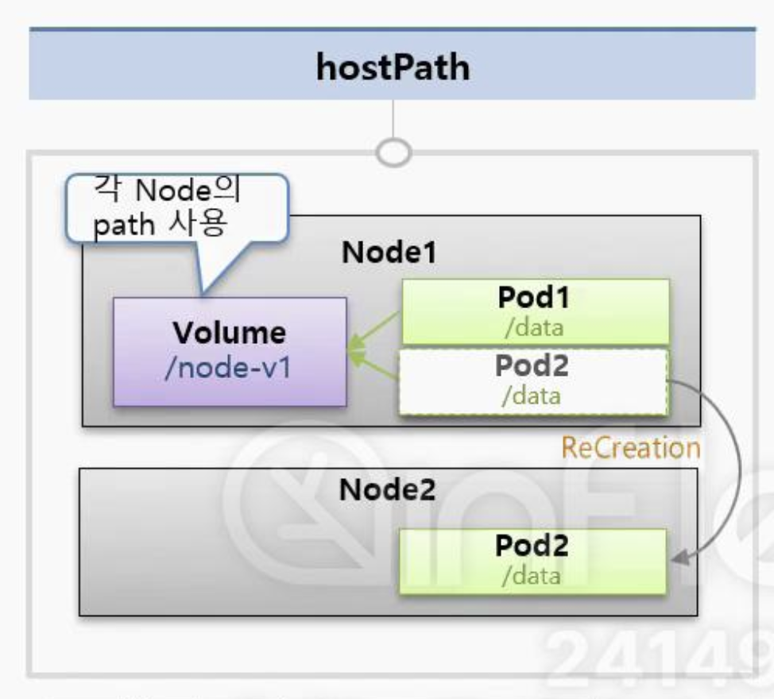
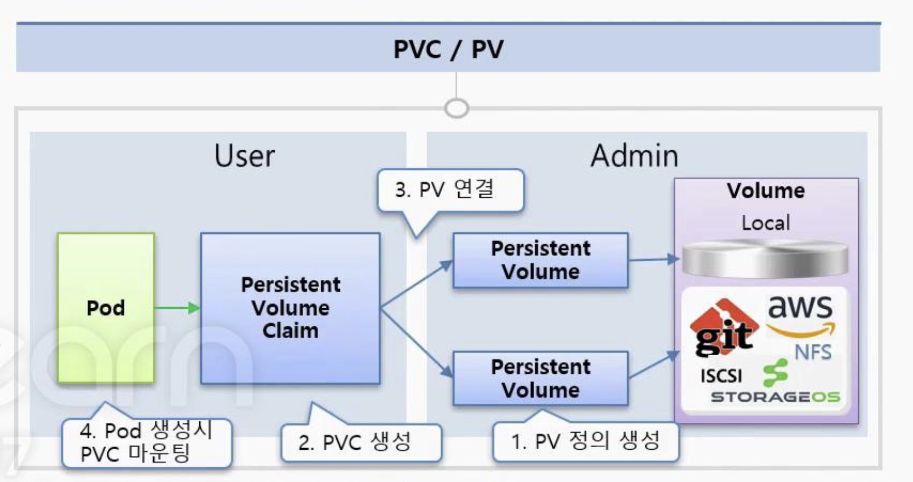

# Volume - emptyDir, hostPath, PV/PVC

## emptyDir



```yaml
# emptyDir 관련 설정
---
apiVersion: v1
kind: Pod
metadata:
  name: pod-volume-1
spec:
  containers:
  - name: container1 # 1번 컨테이너
    image: tmkube/init # 이미지명
    volumeMounts:
    - name: empty-dir # volume 이름 지정
      mountPath: /mount1 # mount point
  - name: container2 # 2번 컨테이너
    image: tmkube/init # 이미지명
    volumeMounts:
    - name: empty-dir # volume 이름 지정
      mountPath: /mount2 # mount point
  volumes:
  - name: empty-dir # volume 이름
    emptyDir: {}
```

`emptyDir`은 `Pod 안`의 `컨테이너`들 `간에` `데이터`를 `공유`할 때 `사용`하는 `볼륨`을 의미한다.  
`최초`에는 `Volume`이 `비워져있기에` `emptyDir`라 `지칭`하며, 각 컨테이너는 해당 볼륨을 로컬 파일처럼  
사용할 수 있다.

> 😨 Volume 데이터는 휘발성이다?

`emptyDir`의 `Volume`은 `기본적`으로 `휘발성 데이터`로, `Pod`가 `종료`되는 경우 `모든 데이터가 사라진다`.  
하여 `emptyDir Volume`을 `사용`하는 경우에는 `반드시 임시 데이터를 저장`하는 `용도`로 사용해야 한다.

## hostPath



```yaml
---
apiVersion: v1
kind: Pod
metadata:
  name: pod-volume-2
spec:
  containers:
  - name: container
    image: tmkube/init
    volumeMounts:
    - name: host-pah
      mountPath: /mount1
  volumes:
  - name: host-path
    hostPath:
      path: node-v
      type: Directory
```

`hostPath`는 `파드`가 올라가있는 `Node`의 `특정 Path`를 `볼륨`으로 `사용`하는 것이다.  
emptyDir과 다른 점은, Node의 특정 경로를 Pod들이 마운트(mount)해서 사용하기에 Pod가 죽어도 데이터는 유지된다.

> 🤔 데이터가 유지된다고 하니 좋아보이지만, 꼭 좋은 것은 아니라고 한다?

만약 Node1에 구동되고 있던 Pod1이 죽게되면 k8s 스케쥴러에 의해 파드가 다시 구동될 것인데,  
Node1 or Node2 중 어떤 Node에 Pod1이 생성될지는 모르는 법이다. 만약 Node1에 구동되고 있던 Pod1이  
Node2에 생성되면 기존 Volume은 사용하지 못하는 상황이 발생한다.

굳이 이러한 부분을 해소하기 위해, 신규 Node가 생길때마다 동일한 마운트 경로(path)를 만들고,  
직접 Node간의 Path를 마운팅 해주는 방법이 있으나, 운영자가 이러한 부분을 수동으로 처리해야 한다.

> 🥲 hostPath는 언제 사용하면 좋을까?  
> 크게 와닿지는 않지만, Pod에서 Node의 특정 경로에 접근해야 하는 경우 사용한다고 인지하자

1. Pod에서 Node의 특정 경로에서 시스템 or 서비스 로그를 수집해야 하는 경우?
2. 클러스터 전체 모니터링을 위해, fluentd와 같은 로그 수집기를 사용하는 경우가 있다,
fluentd는 Node의 특정 경로에 접근해서 로그 수집 후 모니터링 수집 툴(Prometheus)에 전송한다

## PV/PVC



PV/PVC는 파드의 지속적인 스토리지를 제공하는 역할을 한다.

### PV(PersistentVolume)

```yaml
# 관리자가 NFS, 벤더사의 물리적 HDD를 정의하는 파일을 PV라 지칭
apiVersion: v1
kind: PersistentVolume
metadata:
  name: pv-example
spec:
  capacity:
    storage: 1Gi # 1GB
  accessModes:
    - ReadWriteOnce
  persistentVolumeReclaimPolicy: Retain # PV의 재사용 정책, Retain은 삭제된 후에도 데이터를 쥬ㅣ
  hostPath:
    path: /node-v # 노드의 로컬 파일 시스템 경로, 이 경로를 Pod가 마운트하여 사용
```

```yaml
# 2번째 예시
apiVersion: v1
kind: PersistentVolume
metadata:
  name: pv-01
spec:
  capacity:
    storage: 1G
  accessModes:
  - ReadWriteOnce
  local:
    path: /node-v
  nodeAffinity:
    required:
      nodeSelectorTerms:
      - matchExpressions:
        - {key: kubernetes.io/hostname, operator: In, values: [k8s-node1]}
```

`PV`(PersistentVolume)란 `관리자가 미리 만들어둔` `물리적인 스토리지 자원`을 의미한다.  
`NFS`, `클라우드 스토리지`(GCP, AWS EBS 등), `로컬 디스크` 등을 `사용할 수 있다`.

`PV`(PersistentVolume)은 `클러스터의 리소스`이므로 `Pod의 라이프사이클`과는 `독립적`이며,  
`Pod가` `재생성`되더라도 `데이터`는 `보존`되는 특징을 갖는다.

예: 관리자에 의해 /data 디렉토리가 PV로 생성되면, k8s는 이를 저장공간으로 사용할  
준비가 된 리소스로 인식한다.

### PVC(PersistentVolumeClaim)

```yaml
apiVersion: v1
kind: PersistentVolumeClaim
metadata:
  name: pvc-example
spec:
  accessModes:
    - ReadWriteOnce
  resources:
    requests:
      storage: 1Gi
```

```yaml
# Pod가 사용할때
apiVersion: v1
kind: Pod
metadata:
  name: pod-using-pvc
spec:
  containers:
    - name: my-container
      image: nginx
      volumeMounts:
        - mountPath: "/data"
          name: my-volume
  volumes:
    - name: my-volume
      persistentVolumeClaim:
        claimName: pvc-example
```

`PVC`(PersistentVolumeClaim)란 `사용자가 필요로 하는 스토리지를 요청`하는 `요청서`라고 볼 수 있다.  
`사용자`는 `PVC`를 통해 `필요한 용량`, `접근 모드`를 `명시`하여 `k8s`에게 `스토리지를 요청`한다.

후에 k8s는 PVC와 조건이 맞는 PV를 찾아 자동으로 연결한다.  
이로써 Pod는 PVC를 통해 PV에 접근할 수 있게 되며, 데이터 읽기/쓰기가 가능해진다.

> 🥲 정리를 해보자면..

1. 관리자는 PV(PersistentVolume)을 생성하여 클러스터에 필요한 스토리지 제공
2. 사용자는 PVC(PersistentVolumeClaim)를 통해 PV를 요청, k8s는 요청 조건에 맞는 PV를 자동으로 연결
3. Pod는 PVC(PersistentVolumeClaim)를 사용하여 데이터를 읽고/쓰기 때문에, 데이터는 영구 보존

## 99. 참고 자료

- [Volume - emptyDir, hostPath, PV/PVC](https://www.inflearn.com/course/lecture?courseSlug=%EC%BF%A0%EB%B2%84%EB%84%A4%ED%8B%B0%EC%8A%A4-%EA%B8%B0%EC%B4%88&unitId=23461&tab=curriculum)