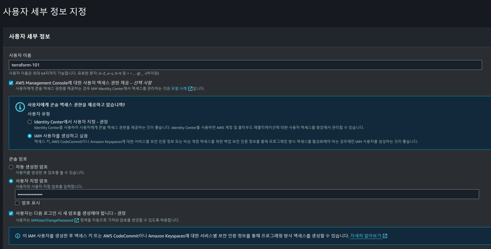

# AWS Configure 설정

> AWS EC2 서버 내에서 사용할 AWS Configure 셋팅을 진행  
> 이왕이면 Role을 사용하는 것이 좋고, access_key, secret_access_key 사용은 지양해야 한다  
> 여기서는 신규 사용자를 만들고 해당 사용자의 access_key 발급 후 진행

## AWS Configure 셋팅

`AWS`의 `모든 리소스`는 A`PI로 통신`이 이루어진다.  
하지만 `API 요청`을 하기 위해서는 `자격증명`이 허용되어야 가능하다.

AWS는 AWS CLI, SDK, IaC(CloudFormation) 등을 제공하여 API 통신을 가능하게 만들어준다.  
Terraform은 사실 SDK를 사용한다 볼 수 있는데, 내부적으로 요청을 하기 때문이다.  
API 사용을 위해 `AWS 사용자를 만들고` 해당 `사용자`의 `access_key`, `secret_access_key`를 발급해보자.

### IAM 사용자 생성

- IAM > 사용자 > 사용자 추가 클릭
- 사용자 이름: terraform-101
- 엑세스 유형: 프로그래밍 방식, AWS Management Console 엑세스
- 콘솔 비밀번호: 자유 입력



- 다음:권한 클릭
- 직접 정책 연결 -> AdministratorAccess 체크
- 다음: 태그 클릭
- 다음: 검토 클릭
- 사용자 만들기 클릭
- csv 파일은 따로 보관

### Configure 셋팅

```shell
$ aws configure
AWS Access Key ID [None]: Axxxxxxxxxxxxxxxxxxxxx
AWS Secret Access Key [None]: Hxxxxxxxxxxxxxxxxxxxxx
Default region name [None]: ap-northeast-2
Default output format [None]: json
```

## 99. 참고 자료

- [[Terraform] AWS Configure 구성](https://terraform101.inflearn.devopsart.dev/preparation/aws-configure/)