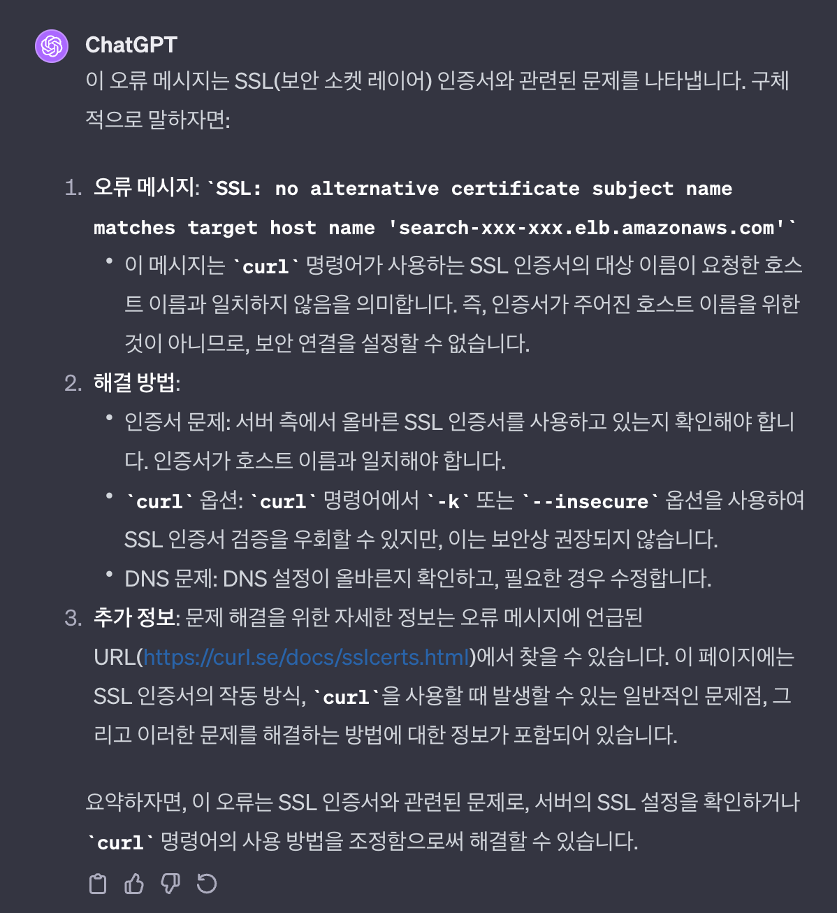

# 01. 이슈 내용

```shell
curl -XPOST 'https://search-xxx-xxx.elb.amazonaws.com/retrieve/contents' --header 'Content-Type: application/json'
```

- AWS Stage 서버에 API를 배포한 후 테스트가 필요하여 위와 같이 curl 요청을 날리는 상황에 아래와 같은 에러가 출력되었다

```shell
curl: (60) SSL: no alternative certificate subject name matches target host name 'search-xxx-xxx.elb.amazonaws.com'
More details here: <https://curl.se/docs/sslcerts.html>

curl failed to verify the legitimacy of the server and therefore could not
establish a secure connection to it. To learn more about this situation and
how to fix it, please visit the web page mentioned above.
```

- 위와같은 ERROR가 출력된 이유는 Source(로컬 Client 데스크탑) ---> Destination(Web Server : Nginx) 요청 시에 해당 Web Server가 HTTPS(TLS/SSL)를 사용하였기에 요청이 불가능한 것이였다

# 02. 해소 방안



```shell
curl -k -XPOST 'https://search-xxx-xxx.elb.amazonaws.com/retrieve/contents'--header 'Content-Type: application/json'
```

- 당시에는 테스트 수행만 이루어지면 되는 상황이여서, 아래와 같이 `-k(--insecure) 옵션을 사용`하여 ERROR 해소
- `-k` 옵션의 경우 https 사이트를 SSL certificate 검증없이 연결하는 경우 사용이 되는 옵션이다
- `wget --no-check-certificate` 와 비슷한 역할을 수행한다고 한다

# 99. 참고 자료

- [curl: (60) schannel: SEC_E_UNTRUSTED_ROOT #ElasticSearch 8.3.3](https://nanglam.tistory.com/34)
- [[Linux명령어]curl 주요 옵션 설명](https://kim-dragon.tistory.com/47)