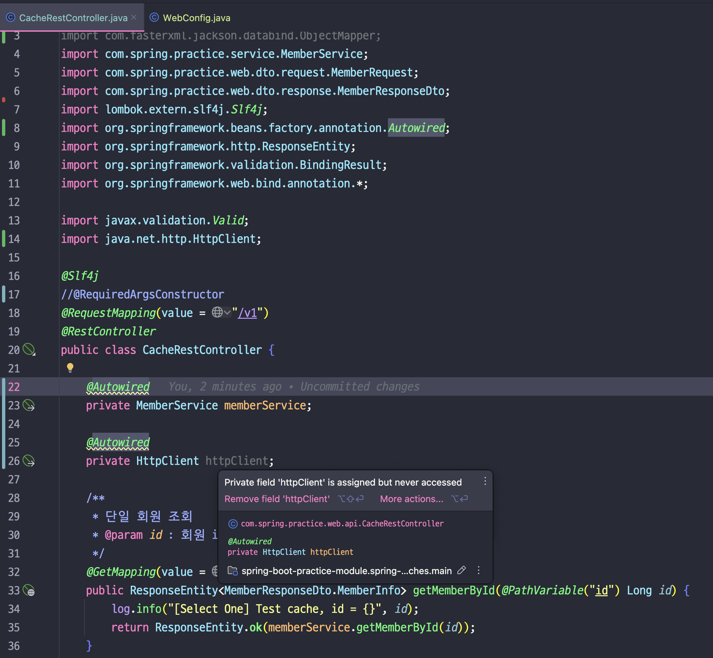

# 01. @Bean vs @Component

> 개발을 하다보면 @Bean, @Component를 언제 사용해야 하는지 헷갈리는 경우가 발생한다  
>   
> 2개의 어노테이션(@Bean, @Component) 모두 일반 Java 객체를 IoC 컨테이너에 의해서 관리되어지는 스프링 bean 객체로 등록(Bean 생성)하기 위해 사용하는 것이라고는 알고 있는데...?  
>
> 그렇다면 어떠한 경우 @Bean을 사용하고, @Component를 사용해야 하는걸까?  
> 이러한 궁금증에 대해 간략히 정리해보자!

## 01-1. IoC와 빈이 등록되는 방법에 대한 관계

- `스프링`은 `개발의 제어권`이 `스프링 IoC 컨테이너`에 있다고 한다. 그래서 이를 `IoC`(`제어의 역전이라 한다`)
- `컨테이너`(IoC)가 `개발자 대신 객체를 제어`하기 위해서는 `객체`들이 `빈`(Bean)로 `등록`되어 있어야 한다
- 과거에는 `XML`로 `Bean을 등록`하였지만 최근에는 `어노테이션`를 `사용`하면 된다.
  - 1) @Controller, @Service, @Repository, @Component 등으로 빈 등록 가능(Component Scan 대상)  
  - 2) @Bean(수동 빈 등록), @Component 등으로 IoC 컨테이너에 빈으로 등록 가능
- 여기서 중요한 포인트는 `스프링 IoC 컨테이너가 개발자 대신 객체를 제어하려면 Bean으로 등록이 되어 있어야 한다` 이 부분이다
- 우선 `@Bean`, `@Component`로 작성한 코드를 보자

```java
@Configuration
public class AppConfig {
    
    @Bean
    public MemberService memberService() {
        return new MemberServiceImpl();
    }

    @Bean
    public MyRepository myRepository() {
        return new MyRepositoryImpl();
    }
}
```

```java
@Component
public class ComponentTest {
    // ...중략
}
```

- @Configuration
  - `해당 어노테이션`은 `스프링 설정 파일 역할`을 한다는 것을 나타냄
  - bean을 등록할 때 `싱글톤`(singleton)이 되도록 보장
  - `스프링 IoC 컨테이너`에서 `bean을 관리`할 수 있게 됨
- @Bean
  - `메서드`가 `반환하는 객체(정확히는 MemberServiceImpl)`를 스프링 `IoC 컨테이너`에서 `관리`하는 `bean로 등록`
- @Component
  - `해당 자바 클래스`가 `스프링`의 `관리 대상 빈`(bean)임을 표시
  - `빈 이름`은 `클래스 이름`의 `첫 글자를 소문자로 변환`한 형태
  - `@Component`가 붙은 클래스는 `ComponentScan`에 의해 스프링 IoC 컨테이너에 등록됨
  - @Controller, @Service, @Repository 컴포넌트 스캔 대상
  - **@Component 어노테이션이 없는 일반 클래스는 컴포넌트 스캔 대상이 아님**

## 01-2. @Bean, @Component 언제 사용해야 하는가?

> 인프랩 CTO 향로님의 말을 인용하면 아래와 같다  

- @Bean
  - `컨트롤이 불가능`한 `외부 클래스`를 spring `bean`로 `등록`해야 하는 경우
- @Component
  - `개발자`가 `직접 컨트롤이 가능`한 `클래스`를 spring `bean`로 `등록`해야 하는 경우
- 아래 예시를 한번 살펴보자, 먼저 @Bean이다

### 예시1: HttpClient.java

```java
/**
 * @author Herb Jellinek
 * @author Dave Brown
 */
public class HttpClient extends NetworkClient {
    // whether this httpclient comes from the cache
    protected boolean cachedHttpClient = false;

    protected boolean inCache;

    // Http requests we send
    MessageHeader requests;

    // Http data we send with the headers
    PosterOutputStream poster = null;

    // true if we are in streaming mode (fixed length or chunked)
    boolean streaming;

    // if we've had one io error
    boolean failedOnce = false;

    /** Response code for CONTINUE */
    private boolean ignoreContinue = true;
    private static final int    HTTP_CONTINUE = 100;

    //..중략
```

- ex) 현재 우리는 HttpClient 클래스를 스프링 IoC의 bean로 등록하여 사용하고 싶다
- 하지만 `HttpClient`의 경우 `외부 라이브러리` 이기에 `수정`이 `불가능`하다
  - 해당 클래스에 @Component 사용 불가능
- 그렇기에 해당 `외부 클래스`는 `@Configuration + @Bean`통해 `IoC bean`로 등록해야 한다

```java
package com.spring.practice.config;

import org.springframework.context.annotation.Bean;
import org.springframework.context.annotation.Configuration;

import java.net.http.HttpClient;

@Configuration
public class WebConfig {

    @Bean
    public HttpClient httpClient() {
        return HttpClient.newHttpClient();
    }
}
```

- HttpClient 클래스를 IoC에 의해 관리되는 bean로 등록
- 실제 IoC 컨테이너 안에 httpClient 라는 이름으로 bean 등록이 된다
- 이렇게 bean을 등록했을 경우의 이점이 무엇일까?
  - 필자의 생각으로는 DI를 수행할 수 있기 때문에 저렇게 사용한다 생각한다

> ❌ 만약 WebConfig에 HttpClient 객체가 bean로 등록되지 않으면 아래와 같은 현상이 발생한다


- HttpClient 객체를 Autowired하려고 하지만 해당 bean 타입 찾을 수 없음


- HttpClient 객체를 Bean로 등록해준다



- HttpClient 사용이 가능해진다
- @Autowired의 경우 사용을 지양하자, 생성자 주입 사용할 것(예시를 위해 사용했을 뿐)

## 99. 참고 자료

- [@Bean vs @Component : 향로님 블로그 내용](https://jojoldu.tistory.com/27)
- [Bean과 Component 차이](https://youngjinmo.github.io/2021/06/bean-component/)