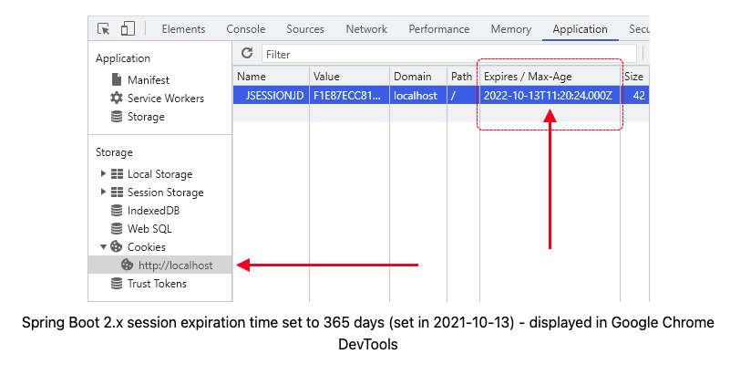

# [Java] Cookie & Session

# 01. HTTP 특성

[쿠키, 세션, 토큰(JWT) 몰라도 괜찮겠어?](https://velog.io/@whitebear/쿠키-세션-토큰JWT-확실히-알고-가기)

- HTTP란 인터넷 상에서 데이터를 주고 받기 위한 서버/클라이언트 모델을 따르는 프로토콜
- HTTP는 비연결성(Connectionless), 무상태성(Stateless) 특징을 가짐
- HTTP는 요청 처리 완료 후 연결을 끊어버리며, 클라이언트의 상태 정보 및 현재 통신 상태가 남아있지 않음
- HTTP의 비연결성 및 무상태성 장/단점
    - 장점 : 리소스 낭비를 줄일 수 있음
    - 단점 : 클라이언트가 누군지 알 수 없음 ( 새로고침 후 재로그인, 페이지 이동해도 재로그인.. 등등 )
- HTTP의 단점을 극복하기 위해 나온 기능이 쿠키(Cookie) 그리고 세션(Session) 이다

# 02. 쿠키(Cookie)

- 클라이언트가 어떤 웹 사이트를 방문하는 경우, 해당 사이트의 서버로부터 받는 작은 데이터 파일
- 브라우저는 매 요청마다 해당 쿠키를 헤더 담아서 서버에 요청
- 서버는 쿠키 정보를 바탕으로 클라이언트 식별 가능
- 종료
    - 영속 쿠키 : Java에서 만료 날짜 입력 시 해당 날짜까지 유지
    - 세션 쿠키 : Java에서 만료 날짜 생략 시 브라우저 종료시까지만 유지
- 장점
    - 상태 유지 가능
    - 네트워크 트래픽 감소 (필요한 정보만 전송 가능)
- 단점
    - 보안 취약 (요청 시 쿠키 값 그대로 전송, 조작 위험)
    - 용량 제한(4KB)으로 많은 정보 담을 수 없음
    - 쿠키 사이즈 커질수록 네트워크 부하 심해짐
- 사용
    - 30일간 다시보지 않기 (쿠키에 체크한 날짜를 기록하고, 재방문시 시간차를 계산)
    - 비로그인 쇼핑몰 장바구니 기능
    - 아이디 저장, 로그인 상태 유지
    - 최근 검색 결과 기반 제품 추천

# 03. 세션(Session)

- 비밀번호 등 클라이언트 인증 정보를 서버 측에 저장하고 관리
- 로그인 요청에 대한 응답 작성 시, 인증 정보는 서버에 저장하고 클라이언트 식별자인 JSESSIONID를 쿠키에 담음
- 클라이언트는 매 요청마다 JSESSIONID 쿠키를 함께 전송, 서버는 JSESSIONID를 통해 클라이언트 식별
- 장점
    - 쿠키를 포함한 요청이 외부에 노출되어도 세션 ID 자체에는 중요한 개인 정보를 담지 않음
    - 각 사용자마다 고유한 세션 ID가 발급됨, 요청 마다 회원 정보 확인 필요 없음
- 단점
    - 해커가 세션 ID 탈취하여 특정 클라이언트로 위장 가능
    - 요청이 많아지면 서버 부하가 생김

# 04. 세션만 쓰면 되는데 쿠키를 왜 사용해야 하는가?

<aside>
💡 세션이 쿠키에 비해 보안도 좋은데, 쿠키를 사용하는 이유는 다음과 같다

</aside>

- 세션은 서버에 저장되고, **서버 자원**을 **사용**하기에 사용자가 몰리면 소모되는 자원이 상당함
- 자원관리 차원에서 쿠키와 세션을 적절한 요소 및 기능에 병행 사용하여 서버의 자원 낭비 방지
- 서버에 저장된 사용자 세션 정보를 통해 다음 프로세스 진행을 막을 수 있음
    - 세션 값 획득 → 값 체크(validation) → 로그아웃(logout)

# 05. 쿠키 세션 차이

|  | 쿠키(Cookie) | 세션(Session) |
| --- | --- | --- |
| 저장 위치 | 클라이언트(=접속자 PC) | 웹 서버 |
| 저장 형식 | Text | Object |
| 만료 시점 | 쿠키 저장시 설정(브라우저 종료되도, 만료시점 안 지나면 자동 삭제 안됨) | 브라우저 종료시 삭제(기간 지정 가능) |
| 사용하는 자원(리소스) | 클라이언트 리소스 | 웹 서버 리소스 |
| 용량 제한 | - 총 300개   - 하나의 도메인 당 20개   - 하나의 쿠키 당 4KB(=4096 byte) | 서버가 허용하는 한 용량 제한 없음 |
| 속도 | 세션보다 빠름 | 쿠키보다 느림 |
| 보안 | 세션보다 안좋음 | 쿠키보다 좋음 |

# 99. 참고 자료

- [쿠키, 세션, 토큰(JWT) 몰라도 괜찮겠어?](https://velog.io/@whitebear/쿠키-세션-토큰JWT-확실히-알고-가기)
- [쿠키(Cookie)와 세션(Session)을 이용한 로그인](https://itstory1592.tistory.com/62)
- [쿠키(Cookie), 세션(Session) 특징 및 차이](https://hahahoho5915.tistory.com/32)