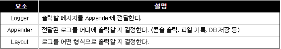

# 등장 순서

등장한 시간 순서대로 비교하면 `log4j`, `logback`, `log4j2` 순서로 등장 했다.  
또한 logback과 log4j2는 log4j를 기반으로 하고 있어서 설정하는 방법이나 사용 방법이 유사하다.

# log4j.xml

Apache의 log4j는 꽤 오래된 로깅 프레임워크로써, 2015년 개발팀의 log4j 개발 중단 발표가 있었다.
또한 이제는 새로운 프로젝트에 적용 하려면 다른 로깅 프레임워크를 사용 해야 한다.

# 로그 레벨

> 로그 레벨의 순서는 아래와 같다.  
> TRACE > DEBUG > INFO > WARN > ERROR > FATAL

# Log4j 구성 요소



- log4j를 사용하려면 아래와 같이 pom.xml 파일에 아래와 같이 dependency 추가가 필요하다.

```xml
<-- Example 01 -->
<dependency>
    <groupId>log4j</groupId>
    <artifactId>log4j</artifactId>
    <version>1.2.17</version>
</dependency>

<-- Example 02 -->
<!-- Logging -->
<dependency>
	<groupId>org.slf4j</groupId>
	<artifactId>slf4j-api</artifactId>
	<version>${org.slf4j-version}</version>
</dependency>
<dependency>
	<groupId>org.slf4j</groupId>
	<artifactId>jcl-over-slf4j</artifactId>
	<version>${org.slf4j-version}</version>
	<scope>runtime</scope>
</dependency>
<dependency>
	<groupId>org.slf4j</groupId>
	<artifactId>slf4j-log4j12</artifactId>
	<version>${org.slf4j-version}</version>
	<scope>runtime</scope>
</dependency>
<dependency>
	<groupId>log4j</groupId>
	<artifactId>log4j</artifactId>
	<version>1.2.15</version>
	<exclusions>
		<exclusion>
			<groupId>javax.mail</groupId>
			<artifactId>mail</artifactId>
		</exclusion>
		<exclusion>
			<groupId>javax.jms</groupId>
			<artifactId>jms</artifactId>
		</exclusion>
		<exclusion>
			<groupId>com.sun.jdmk</groupId>
			<artifactId>jmxtools</artifactId>
		</exclusion>
		<exclusion>
			<groupId>com.sun.jmx</groupId>
			<artifactId>jmxri</artifactId>
		</exclusion>
	</exclusions>
	<scope>runtime</scope>
</dependency>
```

- 또한 아래와 같이 xml을 사용해 설정 파일을 지정 하면 된다.

```xml
<?xml version="1.0" encoding="UTF-8"?>
<!DOCTYPE log4j:configuration PUBLIC "-//APACHE//DTD LOG4J 1.2//EN" "log4j.dtd">
<log4j:configuration xmlns:log4j="http://jakarta.apache.org/log4j/">
 
    <!-- Appenders -->
    <appender name="console" class="org.apache.log4j.ConsoleAppender">
        <param name="Target" value="System.out" />
        <layout class="org.apache.log4j.PatternLayout">
            <param name="ConversionPattern" value="[%d{yyyy-MM-dd HH:mm:ss}] %-5p: %c - %m%n" />
        </layout>
    </appender>
    
    <logger name="freemarker">
    	<level value="off"/>
    </logger>
    
    <!-- Application Loggers -->
    <logger name="com.joycity.template">
        <level value="debug" />
    </logger>
    
    <!-- 3rdparty Loggers -->
    <logger name="org.springframework.core">
        <level value="info" />
    </logger>    
    
    <logger name="org.springframework.beans">
        <level value="info" />
    </logger>
    
    <logger name="org.springframework.context">
        <level value="info" />
    </logger>
 
    <logger name="org.springframework.web">
        <level value="info" />
    </logger>
 
    <!-- Root Logger -->
    <root>
        <priority value="debug" />
        <appender-ref ref="console" />
    </root>
    
</log4j:configuration>
```

### log4j를 기반으로 한 logback

우선 log4j를 개발한 개발자가 logback을 개발 하였다.  
log4j와 아주 유사하면서도 향상된 성능과 필터링 옵션을 제공하며 slf4j도 지원한다.  
그리고 참 편리한 자동 리로드도 가능하다.

> 자동 리로드?

Linux 서버 내에서 log4j를 사용할 시 log level을 변경 하게 되면, 서버를 재 가동하여 반영 사항을 적용 해줘야 한다.  
하지만 logback.xml을 서버를 재 가동할 필요 없이, 즉각 자동 리로드를 지원 해준다.

Maven으로 관리하는 프로젝트에서 logback 관련 dependency를 추가하려고 하면 logback-core와 logback-classic을 확인할 수 있다.  
**core**의 경우 로깅 프레임워크로서의 핵심 기능이 포함되어 있다. **classic**의 경우는 핵심 기능에 slf4j에 대한 지원과 같은 추가 기능을 제공 한다.

logback을 사용하려면 아래와 같이 dependency를 추가하면 된다.

```xml
<dependency>
	<groupId>ch.qos.logback</groupId>
	<artifactId>logback-classic</artifactId>
	<version>1.2.3</version>
</dependency>

<dependency>
	<groupId>ch.qos.logback</groupId>
	<artifactId>logback-core</artifactId>
	<version>1.2.3</version>
</dependency>
```

- 설정은 xml로 진행을 한다.

```xml
<?xml version="1.0" encoding="UTF-8"?>
<configuration>
    <!-- Console Log Setting -->
    <appender name="STDOUT" class="ch.qos.logback.core.ConsoleAppender">
        <layout class="ch.qos.logback.classic.PatternLayout">
            <encoder>
<!--                 <pattern>[%d{yyyy/MM/dd HH:mm:ss}] %-5level %cyan(%-25.25logger{0}) | %msg%n</pattern> -->
            	<Pattern>[%d{yyyy-MM-dd HH:mm:ss}] %-4level [%cyan(%logger{36})] - %msg%n</Pattern>
            </encoder>
        </layout>
    </appender>
 
 	<logger name="com.joycity.test">
		<level value="off" />
	</logger>
	
	<!-- 3rdparty Loggers -->
	<logger name="org.springframework.core">
		<level value="INFO" />
	</logger>
	
	<logger name="org.springframework.beans">
		<level value="INFO" />
	</logger>
	
	<logger name="org.springframework.context">
		<level value="INFO" />
	</logger>

	<logger name="org.springframework.web">
		<level value="INFO" />
	</logger>
 
    <root level="INFO">
        <appender-ref ref="STDOUT" />
    </root>
 
</configuration>
```

### log4j2

 log4j2는 log4j와 logback과 비교했을 때 가장 최근에 등장 했다. logback과 동일하게 자동 리로드 필터링 기능을 제공 한다.

log4j2를 사용하려면 아래와 같이 dependency를 선언하면 된다.

```xml
<dependency>
    <groupId>org.slf4j</groupId>
    <artifactId>slf4j-api</artifactId>
    <version>1.7.25</version>
</dependency>
<dependency>
    <groupId>org.apache.logging.log4j</groupId>
    <artifactId>log4j-api</artifactId>
    <version>2.9.0</version>
</dependency>
<dependency>
    <groupId>org.apache.logging.log4j</groupId>
    <artifactId>log4j-core</artifactId>
    <version>2.9.0</version>
</dependency>
<dependency>
    <groupId>org.apache.logging.log4j</groupId>
    <artifactId>log4j-slf4j-impl</artifactId>
    <version>2.9.0</version>
</dependency>
```

- log4j2에 대한 설정은 다음과 같이 진행하면 됩니다.  
- log4j2.xml을 생성하고 아래와 같이 작성합니다.

```xml
<?xml version="1.0" encoding="UTF-8"?>
<Configuration status="warn" >
    <Appenders>
        <Console name="STDOUT" target="SYSTEM_OUT">
            <PatternLayout pattern="%d{HH:mm:ss.SSS} [%t] %-5level %logger{36} - %msg%n"/>
        </Console>
    </Appenders>
    <Loggers>
        <Root level="info">
            <AppenderRef ref="STDOUT"/>
        </Root>
    </Loggers>
</Configuration>
```

## 테스트

> 테스트 진행 시 영역을 구분하여 테스트를 수행 한다.

- 쉽게 말해 Html과 Javascript의 싱크가 동일해야 하고 또한 Javascript의 싱크가 백단(Controller)의 싱크과 동일해야 한다

> 싱크가 같다는 의미?**

- Html의 이메일 maxlength가 50인데 Javascript의 validation length가 20인 경우
- Javascript의 validation length가 20인데, 백단에서의 validation이 10인 경우

### 어떻게 로그를 남길 것인가?

- 로그는 기록을 남기는 것을 의미한다.
- 구체적으로 프로그램 개발 및 운영 시 발생하는 문제점을 추적 하거나 운영 상태를 모니터링 하는 정보를 기록하는 것이다.
- 또한 분석을 통해 통계를 낼 수 있기 때문에 기록을 남기는 것은 중요하다고 할 수 있다.

### QA 환경에서의 로그

- 기본적으로 QA 환경에서는 정확하고 자세한 정보가 필요하기 때문에, 기본적으로 DEBUG 레벨 사용.

```xml
<logger name="com.joycity.template">
	<level value="debug" />
</logger>
```

### Live 환경에서의 로그

- 기본적으로 Live 환경에서는 에러를 나타낼 수 있는 로그를 제외하고 부가적인 로그를 찍으면 안된다.

```xml
<logger name="com.joycity.template">
	<level value="off" />
</logger>
```